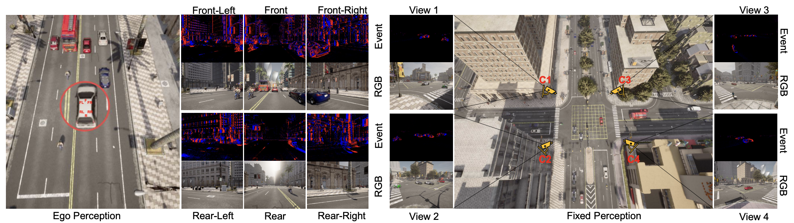
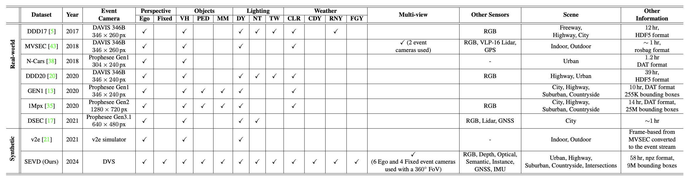
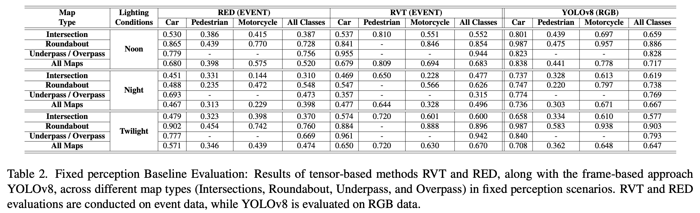
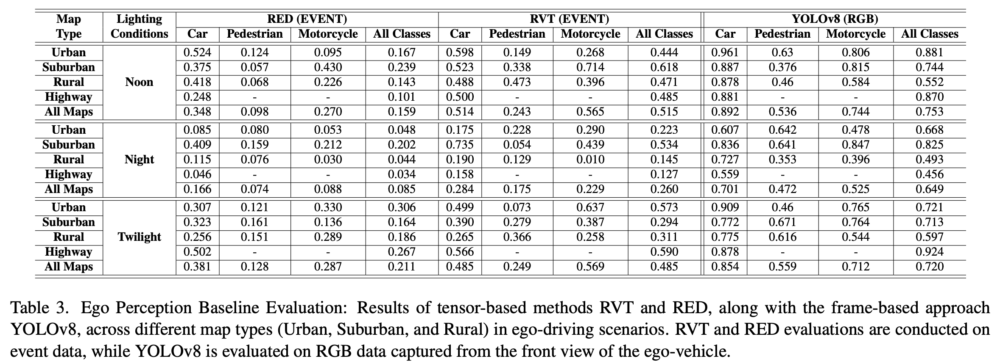

# _SEVD_ : Synthetic Event-based Vision Dataset for Ego and Fixed Traffic Perception

<div>
    <a href="https://arxiv.org/abs/2404.10540" target="_blank">Paper</a> |
    <a href="https://eventbasedvision.github.io/SEVD/" target="_blank">Website</a> |
    <a href="https://docs.google.com/forms/d/e/1FAIpQLSdOhlegSlpzW78DsPSqNCDdfg7IVXsbcKD-BgBnbj_YdjojQg/viewform?usp=sf_link" target="_blank">Data</a> |
    <a href="https://eventbasedvision.github.io/SEVD/documents/SEVD%20Dataset%20Documentation.pdf" target="_blank">Dataset Documentation</a>
</div>
<hr>


In recent years, there has been an increasing focus on neuromorphic or event-based vision due to its ability to excel under high dynamic range conditions, offer high temporal resolution, and consume less power than conventional frame-based vision sensors such as RGB cameras. The event cameras, also known as dynamic vision sensors (DVS), mimic the behavior of biological retinas by continuously sampling incoming light and generating signals only when there is a change in light intensity. This results in an event data stream represented as a sequence of ⟨x, y, p, t⟩ tuple, where (x, y) denotes pixel position, t represents time, and p indicates polarity (positive or negative contrast).

While event-based sensing represents a novel area, research efforts have been limited in recent years to fully utilize the capabilities of event-based cameras for perception tasks. Notably, researchers have predominantly used event- based cameras like DAVIS346 by iniVation and Prophesee’s IMX636 / EVK 4 HD to construct automotive datasets. Additionally, researchers have employed frame-to-event simulators such as ESIM and v2e to generate synthetic event-based data. However, it only converts RGB frames of an outdoor scene from MVSEC. This highlights the significant scarcity of readily available synthetic event-based datasets in the field. To bridge this gap and leverage the potential of synthetic data to generate diverse and high-quality vision data tailored for traffic monitoring, we present SEVD – a Synthetic Event-based Vision Dataset designed for autonomous driving and traffic monitoring tasks.



# Download

The dataset can be downloaded using this [link](https://docs.google.com/forms/d/e/1FAIpQLSdOhlegSlpzW78DsPSqNCDdfg7IVXsbcKD-BgBnbj_YdjojQg/viewform?usp=sf_link).

# Dataset Overview

SEVD provides multi-view (360°) dataset comprising 27 hr of fixed and 31 hr of ego perception data, with over 9M bounding boxes, recorded across diverse conditions and varying parameters. The event cameras are complemented by five different types of sensors, including RGB, depth, optical flow, semantic, instance segmentation cameras, GNSS and IMU sensors resulting in a diverse array of data.

# Folder Structure

```sh
SEVD
├── LICENSE
├── images/
├── rvt/
├── ultralytics/
├── README.md
├── carla/ # data generaton pipeline
```

# Baseline

 </img>
 </img>

The implementation of these models for SEVD can be found here.

[RVT](https://github.com/eventbasedvision/SEVD/tree/main/rvt) |
[YOLO](https://github.com/eventbasedvision/SEVD/tree/main/ultralytics/yolo) |
[RED]()

# License

<a rel="license" href="http://creativecommons.org/licenses/by-sa/4.0/"></a><br />This work is licensed under a <a rel="license" href="http://creativecommons.org/licenses/by-sa/4.0/">Creative Commons Attribution-ShareAlike 4.0 International License</a>.

# Citation

```
@article{aliminati2024sevd,
  title={SEVD: Synthetic Event-based Vision Dataset for Ego and Fixed Traffic Perception},
  author={Aliminati, Manideep Reddy and Chakravarthi, Bharatesh and Verma, Aayush Atul and Vaghela, Arpitsinh and Wei, Hua and Zhou, Xuesong and Yang, Yezhou},
  journal={arXiv preprint arXiv:2404.10540},
  year={2024}
}
```
